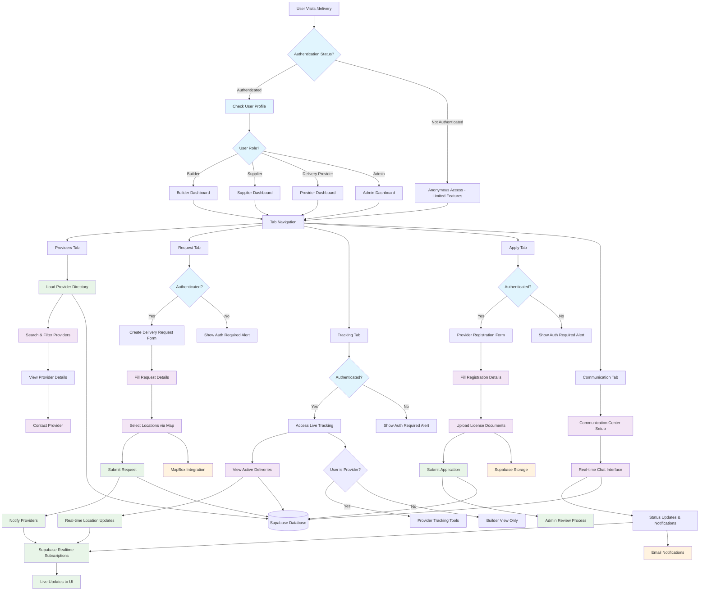

# UjenziPro Delivery Page - Complete Workflow Documentation

## Overview
The Delivery page is a comprehensive platform connecting builders, suppliers, and delivery providers for efficient construction material transportation across Kenya.

## Workflow Diagram



## User Journey Flows

### 1. Anonymous User Journey
```
Landing → Browse Providers → View Provider Details → Contact Info Display
       → Request Tab → Authentication Required Alert
       → Apply Tab → Authentication Required Alert
       → Communication → Setup Required
```

### 2. Builder User Journey
```
Login → Profile Check → Builder Dashboard
     → Browse Providers → Filter by Location/Vehicle → Contact Providers
     → Create Request → Fill Form → Map Location → Submit
     → Track Deliveries → Real-time Updates → Communication
```

### 3. Delivery Provider Journey
```
Login → Profile Check → Provider Dashboard
     → View Requests → Accept/Decline → Update Status
     → Live Tracking → Share Location → Update Progress
     → Communication → Chat with Builders
     → Registration (if not registered) → Document Upload
```

### 4. Supplier User Journey
```
Login → Profile Check → Supplier Dashboard
     → View Provider Network → Find Delivery Partners
     → Track Supplier Deliveries → Monitor Progress
     → Communication with Providers
```

### 5. Admin User Journey
```
Login → Profile Check → Admin Dashboard
     → Manage All Providers → Verify Applications
     → Monitor All Deliveries → System Analytics
     → Review Provider Applications → Approve/Reject
```

## Key Features & Components

### 1. Provider Directory (`DeliveryProvidersList.tsx`)
**Purpose**: Browse and discover delivery providers
- **Search Functionality**: Name, contact person search
- **Advanced Filtering**: Service area, vehicle type, capacity
- **Sorting Options**: Rating, experience, rates
- **Provider Cards**: Detailed provider information
- **Contact Integration**: Direct phone/email links

### 2. Request Management (`DeliveryRequestForm.tsx`)
**Purpose**: Submit delivery requests for materials
- **Location Services**: Interactive map picker
- **Material Categories**: 15+ construction material types
- **Scheduling**: Date and time preferences
- **Requirements**: Vehicle type, budget range
- **Special Instructions**: Custom delivery notes

### 3. Live Tracking (`LiveTrackingViewer.tsx` + `LiveDeliveryTracker.tsx`)
**Purpose**: Real-time delivery monitoring
- **Builder View**: Track incoming deliveries
- **Provider Tools**: Share location, update status
- **Real-time Updates**: WebSocket connections
- **Status Management**: Pickup → Transit → Delivered
- **Communication**: Integrated chat system

### 4. Provider Registration (`DeliveryProviderRegistration.tsx`)
**Purpose**: Onboard new delivery providers
- **Business Information**: Company/individual details
- **Service Configuration**: Areas, vehicle types, rates
- **License Verification**: Document upload system
- **Compliance**: Driving license validation
- **Review Process**: Admin approval workflow

### 5. Communication System (`CommunicationContent.tsx`)
**Purpose**: Real-time stakeholder communication
- **Multi-party Chat**: Builders, providers, suppliers
- **Status Broadcasts**: Delivery milestone updates
- **File Sharing**: Documents, photos, receipts
- **Notification System**: Email and in-app alerts

## Technical Architecture

### Frontend Architecture
```
Delivery Page (Main)
├── Navigation & Layout
├── Tab-based Interface
│   ├── Providers Tab
│   │   └── DeliveryProvidersList
│   ├── Request Tab
│   │   └── DeliveryRequestForm
│   ├── Tracking Tab
│   │   ├── LiveTrackingViewer
│   │   └── LiveDeliveryTracker
│   └── Apply Tab
│       └── DeliveryProviderRegistration
└── Communication Tab
    └── CommunicationContent
```

### State Management
```typescript
// Main Container State
const [userProfile, setUserProfile] = useState<UserProfile | null>(null);
const [loading, setLoading] = useState(true);
const [activeTab, setActiveTab] = useState("providers");

// Provider List State
const [providers, setProviders] = useState<DeliveryProvider[]>([]);
const [searchTerm, setSearchTerm] = useState('');
const [selectedArea, setSelectedArea] = useState('all-areas');
const [selectedVehicleType, setSelectedVehicleType] = useState('all-vehicles');

// Request Form State
const [formData, setFormData] = useState<RequestFormData>({...});
const [activeLocationPicker, setActiveLocationPicker] = useState<'pickup' | 'delivery' | null>(null);

// Tracking State
const [activeDeliveries, setActiveDeliveries] = useState<Delivery[]>([]);
const [trackingData, setTrackingData] = useState<TrackingLocation[]>([]);
```

### Database Schema Integration

#### Core Tables
- **`delivery_providers`**: Provider profiles and capabilities
- **`delivery_requests`**: Delivery requests from builders
- **`delivery_tracking`**: Real-time location data
- **`delivery_communications`**: Chat messages and updates
- **`delivery_status_updates`**: Status change history

#### Key Relationships
```sql
delivery_requests.builder_id → profiles.id
delivery_requests.provider_id → delivery_providers.id
delivery_tracking.delivery_request_id → delivery_requests.id
delivery_communications.delivery_request_id → delivery_requests.id
```

### Real-time Features

#### Supabase Subscriptions
```typescript
// Track delivery updates
const channel = supabase
  .channel('delivery-updates')
  .on('postgres_changes', {
    event: '*',
    schema: 'public',
    table: 'delivery_tracking'
  }, (payload) => {
    updateTrackingData(payload.new);
  })
  .subscribe();

// Communication updates
const commChannel = supabase
  .channel('delivery-communications')
  .on('postgres_changes', {
    event: 'INSERT',
    schema: 'public',
    table: 'delivery_communications'
  }, (payload) => {
    addNewMessage(payload.new);
  })
  .subscribe();
```

## User Experience Design

### Navigation Pattern
- **Tab-based Interface**: Four main sections
- **Progressive Disclosure**: Features revealed based on auth status
- **Mobile-first**: Responsive design with touch-friendly controls
- **Loading States**: Skeleton screens during data fetching

### Authentication Flow
```
Unauthenticated → Limited Browse → Auth Prompt → Login/Register → Full Access
              → Guest Actions    → Feature Locks  → Smooth Onboarding
```

### Error Handling
- **Network Errors**: Retry mechanisms with user feedback
- **Validation Errors**: Inline form validation
- **Permission Errors**: Clear access restriction messages
- **Loading Failures**: Graceful degradation with retry options

## Integration Points

### External Services
1. **MapBox**: Location services and map integration
2. **Supabase Storage**: Document and image uploads
3. **Email Service**: Notification delivery
4. **Real-time Engine**: WebSocket connections

### Internal Integrations
1. **Authentication System**: User login/registration
2. **Profile Management**: User role and permissions
3. **Notification System**: Toast and email alerts
4. **File Upload Service**: Document handling

## Performance Considerations

### Optimization Strategies
- **Component Lazy Loading**: Tab-based code splitting
- **Data Pagination**: Provider list optimization
- **Image Optimization**: Compressed uploads
- **Caching Strategy**: Provider data caching
- **Real-time Throttling**: Location update limits

### Mobile Performance
- **Touch Optimization**: Proper touch targets
- **Bandwidth Awareness**: Optimized data usage
- **Battery Efficiency**: Limited GPS polling
- **Offline Capability**: Basic offline viewing

## Security Implementation

### Access Control
```typescript
// Role-based feature access
{userProfile?.role === 'delivery_provider' && (
  <LiveDeliveryTracker providerId={userProfile.id} />
)}

// Authentication requirements
{userProfile ? (
  <DeliveryRequestForm userProfile={userProfile} />
) : (
  <Alert>Please log in to submit requests</Alert>
)}
```

### Data Protection
- **Input Validation**: All form inputs sanitized
- **File Upload Security**: Type and size restrictions
- **Location Privacy**: Opt-in location sharing
- **Communication Privacy**: User-to-user messaging only

## Analytics & Monitoring

### Key Metrics
- **Provider Registration Rate**: New provider signups
- **Request Completion Rate**: Successful deliveries
- **User Engagement**: Tab usage and session duration
- **Communication Activity**: Message volume and response times

### Performance Metrics
- **Page Load Time**: Initial render performance
- **Real-time Latency**: WebSocket response times
- **Error Rates**: Failed requests and recoveries
- **Mobile Usage**: Device-specific analytics

## Future Enhancements

### Planned Features
1. **Route Optimization**: AI-powered delivery routing
2. **Payment Integration**: In-app payment processing
3. **Rating System**: Provider and builder ratings
4. **Advanced Analytics**: Delivery insights dashboard
5. **Mobile App**: Native iOS/Android applications

### Technical Improvements
1. **PWA Support**: Progressive web app features
2. **Offline Mode**: Enhanced offline capabilities
3. **Push Notifications**: Real-time mobile alerts
4. **API Rate Limiting**: Enhanced security measures
5. **Advanced Caching**: Redis integration

---

## Conclusion

The delivery page provides a comprehensive platform for construction material transportation with:
- **Multi-stakeholder Support**: Builders, providers, suppliers, admins
- **Real-time Capabilities**: Live tracking and communication
- **Professional UX**: Intuitive interface with robust functionality
- **Scalable Architecture**: Modular, maintainable codebase
- **Security Focus**: Proper authentication and access control

This workflow enables efficient coordination of construction material deliveries across Kenya's construction industry.